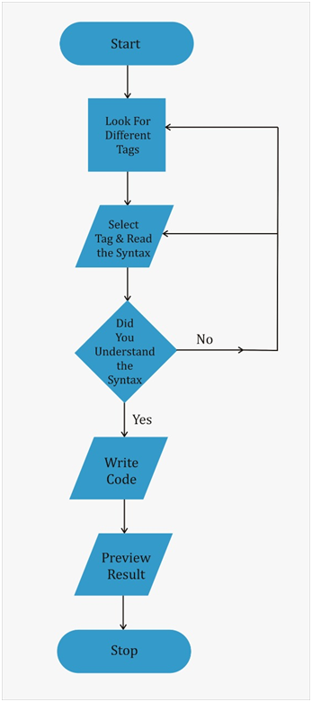
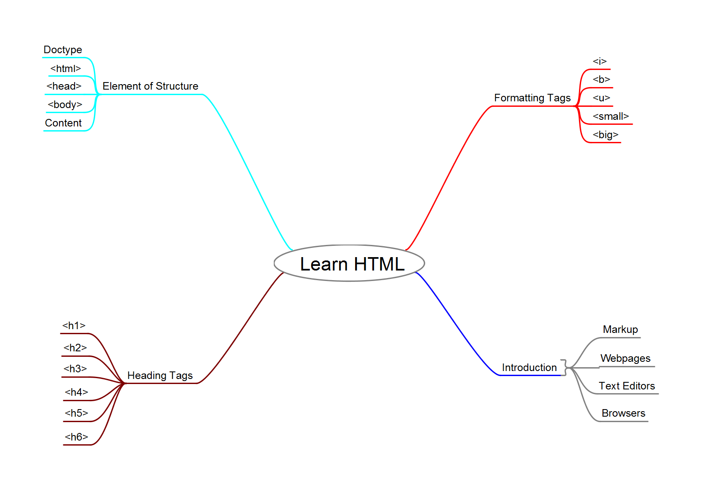

## Storyboard (Round 2)

Experiment 1: Introduction to HTML

### 1. Story Outline:

The Aim of Hyper Text Markup Language Virtual Lab is to make student learn how to write code for an HTML document. The lab consist of theory of different concepts related to the topic of the experiment i.e. Introduction to HTML. Alongwith the theory lab also consists of Pre and Post Experiment Quiz so that student can self evaluate the level of knowledge and understanding. The Simulator of lab provides an easy to understand how HTML tags work. Simulator also provides options to write code, make & rectify errors and view result of the code written by the student. Simulator also provides Pop Up Link to see the procedure for the experiment while performing the same.

### 2. Story:

**2.1	Visual Stage Description**

The lab is designed on the template designed by IIT Bombay for Virtual Labs Development so that the uniformity of the Virtual Labs project can be maintained. On the Left Side of the Window following menu options are given:

a)	Aim:  The learner will be able to demonstrate the working of HTML code and create basic HTML documents. 
b)	Theory:  The theory related to HTML including Introduction, Elements of Structure, different tags, etc is given with examples and figures. 
c)	Pre Test:  This section consists 5 Multiple Choice Questions for self evaluation so that prior knowledge can be known. 
d)	Simulation:  Simulation consists of different interactive options targeted towards the learning of HTML concepts to the students. 
e)	Post Test:  This section consists 5 Multiple Choice Questions for self evaluation so that knowledge gained after performing the experiment can be known. 
f)	References:  This section consists of name of different books and website which can used as references for understanding the concepts in detail. 

**Simulator** 
Simulator consists following components

a)	Preview Section:  
This section shows the preview of the tags selected by student through hovering the cursor on the button given in the next section. Student can identify the difference between various tags of HTML through this section.  
b)	Tag Button: 
On the Left Side below the Preview section different buttons are given. These button are the options for selecting the tags according to which the Syntax of that particular tag will be shown to the adjacent View Syntax section.  
c)	View Syntax Section:   
This section shows the syntax of different HTML tags which are selected by user in the previous section by clicking the button given adjacent.  
d)	Write Code Section: 
This Section lets student write HTML code as per the syntax learned in the previous section. The student can write code with the errors also, the code window will highlight the errors and suggest the ways to rectify the errors, so that effective learning can be made possible.  
e)	Preview Result Section 
This section shows the result of the HTML code written in the adjacent Write Code Section. 

**2.2	User Objective and Goals **
The main Objectives and Goals of the experiment are to enable student to understand, identify, write, rectify and demonstrate the syntax, structure and working of HTML. 

**2.3	Pathway Activities** 
The experiment begins with previewing the output of different tags in Preview Section given at the top of the Simulator by hovering the cursor in the Tag Button Section given below. After previewing the output user can click on any of the Tag Button so that the syntax of that particular tag will be shown in adjacent the Syntax Section. After Understanding the Syntax of any specific HTML tag, the student can write code for that particular tag in the Write Code Section given below and if there will be any error in the code then Simulator will highlight that error so that it can be rectified. Finally after rectifying the errors the result of correct HTML code can be seen in the adjacent Preview Result Section.

**2.4	Allow Pitfalls: **
The Write Code Section of the Simulator allows student to write HTML code without any constraint. Student can write code full of errors, the simulator not only highlight the errors in the code written by student in the Write Code Section but also suggest the corrections in the code so that effective and proper learning of the concept can be made possible.

**2.5	Conclusion:** 
The result of the correct code written in the Write Code Section can be seen in the Preview Result Section and student can get an essence of satisfaction that S/he learned the concept after attempting the Post Experiment Quiz given in the next option of menus.

### 3. Flowchart 4

 

### 4. Mindmap:

 

### 5. Storyboard :
Storyboard: <a href="storyboard/stb.gif">[here]</a>
